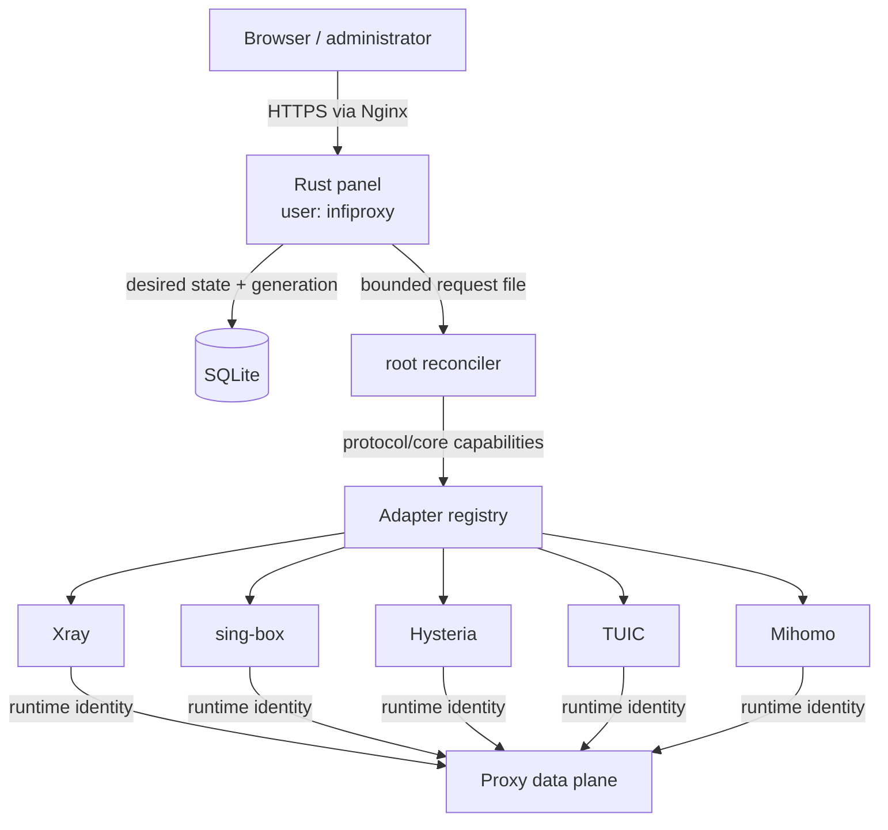

# Infiproxy

Infiproxy is a lightweight Rust control plane for one Linux VPS. It manages
administrators, users, Mihomo-compatible subscriptions, routing policy,
protocol profiles, external proxy runtimes, and their desired state.

Infiproxy does **not** implement proxy protocols or carry user traffic itself.
The data plane is provided by independently installed Xray, sing-box, Hysteria,
TUIC, and Mihomo binaries. The panel generates and reconciles their
configuration through the root reconciler using the built-in adapter registry.

> **Status:** `0.1.0-beta.1`. The architecture and migration contracts are
> tested, but production operators must keep verified backups and validate real
> client handshakes. Traffic limit and usage fields are stored metadata; this
> release has no live runtime traffic collector. Stored values can gate access,
> but they are not independently measured traffic accounting.

## Deployment Model

- One Ubuntu 24.04 LTS or Debian 12 server with systemd.
- Rust/Axum server-rendered panel, static CSS, no JavaScript build pipeline.
- SQLite control-plane state.
- Nginx TLS termination in front of a loopback-only panel.
- Unprivileged `infiproxy` web process.
- Root `infiproxy-reconcile` worker for transactional runtime changes.
- Unprivileged `infiproxy-runtime` identity for proxy services.
- Root-owned module and panel update sources.



The panel records intent first. The reconciler then validates all candidates,
snapshots current state, performs atomic replacement, activates services,
checks listeners/readiness, and only then advances the applied generation. A
post-mutation failure attempts a complete rollback.

## Current Capabilities

User-facing:

- First-owner setup, login, seven-day sessions, password rotation, and logout.
- User create/edit, enable/disable, explicit UTC expiry, stored quota gating,
  subscription-token rotation, runtime-identity rotation, and deletion.
- Per-user Mihomo YAML and account pages protected by bearer tokens.
- Runtime-neutral protocol profiles with automatic capability-based core
  selection; the current web UI does not expose a general core selector.
- DNS policy, transport pools, inline routing policy, rule sets, normalized
  entries, remote sources, and YAML rule providers.
- Runtime inventory, desired/applied generations, and count-only user-sync
  observations.

Operator-facing:

- Full-screen Rust SSH TUI with a legacy recovery fallback.
- Root-approved runtime module install, check, update, start/stop/restart, and
  removal requests.
- Panel update scheduling and immediate update request.
- Cloudflare DNS-01/Certbot-assisted panel HTTPS setup.
- Host, service, runtime, and reconciliation diagnostics.
- Read-only allowlisted configuration inspection in the web UI.
- Review-only uninstall plans in the web UI; execution remains in the root SSH
  manager.

The web panel deliberately has no shell, arbitrary command execution, arbitrary
module URL input, or direct systemd access.

## Runtime Contract

The beta line is tested against exact releases rather than unreviewed `latest`
artifacts:

| Runtime | Validated release | Main role |
|---|---|---|
| Mihomo | `v1.19.30` | Primary modern listener runtime and client parser |
| Xray | `v26.3.27` | VLESS REALITY compatibility runtime |
| sing-box | `v1.13.20` | SS2022/ShadowTLS, legacy AnyTLS, compatibility |
| Hysteria | `app/v2.12.2` | Hysteria2 QUIC runtime |
| TUIC | `tuic-server-1.0.0` | TUIC v5 QUIC runtime |

All starter profiles are inserted disabled. Stable and experimental protocol
compositions, exact runtime capabilities, and pin rationale are documented in
the [runtime compatibility contract](docs/runtime-compatibility.md).

## Quick Install

Review the bootstrap script before executing it as root. The guided installation
for the production `main` channel is:

```bash
curl -fsSL https://raw.githubusercontent.com/infinitrator/stealthhub-panel/main/deploy/bootstrap.sh \
  | sudo bash -s -- --guided --with-nginx
```

The bootstrapper installs build dependencies, ensures Rust is available,
checks out the requested revision under `/opt/infiproxy/source`, builds locked
dependencies, runs the idempotent installer, and opens the SSH manager when a
TTY is available.

If the SSH session is interrupted:

```bash
sudo infiproxy-manager --guided
```

Before installation on an important host, use the non-mutating preflight:

```bash
curl -fsSL https://raw.githubusercontent.com/infinitrator/stealthhub-panel/main/deploy/bootstrap.sh \
  | sudo bash -s -- --check
```

Full prerequisites, SSH/tmux advice, HTTPS setup, firewall planning, and first
runtime activation are in the [Quick Start](wiki/01-QUICK-START.md).

## First Access

With a configured HTTPS vhost, open:

```text
https://panel.example.com/admin/setup
```

Before public HTTPS is ready, keep the backend on loopback and use an SSH
tunnel:

```bash
ssh -L 8080:127.0.0.1:8080 root@server.example.com
```

Then open `http://127.0.0.1:8080/admin/setup` and use the installer-generated
setup token from `/etc/infiproxy/infiproxy.env`. The token must be at least 32
characters; setup closes after the first administrator is created.

## Updates

Panel updates have one source of truth:

```text
/etc/infiproxy-update.conf
REPO=infinitrator/stealthhub-panel
REF=main
```

A fresh install always defaults to `main`; it never inherits the current
checkout branch. A non-main channel requires an explicit operator `--ref` or
`INFIPROXY_UPDATE_REF` override. Manual **Update Now** requests and scheduled
updates both use this same root-owned repository/ref. SQLite settings can
enable scheduling and choose the maintenance time, but cannot replace the
pinned source.

```bash
sudo /usr/local/sbin/infiproxy-panel-update --check
sudo systemctl start infiproxy-panel-update.service
```

The systemd timer evaluates updates every 15 minutes. Automatic panel updates
are enabled by default and use `05:00` server time unless the owner changes the
setting. The panel mirrors root-produced status every two hours.

Runtime modules are independent. Their automatic updates are **off by default**
and must be enabled per module. A module update verifies release metadata and a
digest/checksum, performs a bounded smoke test, preserves configuration, and
atomically switches the `current` symlink. Configuration reconciliation is a
separate transaction.

```bash
sudo infiproxy-module-update --check xray
sudo infiproxy-module-update --update xray
```

See [Modules and Updates](wiki/08-MODULES-AND-UPDATES.md) before changing an
update channel or enabling unattended runtime changes.

## Important Paths

| Path | Purpose |
|---|---|
| `/opt/infiproxy/source` | Installed Git checkout |
| `/usr/local/bin/infiproxy` | Panel binary |
| `/usr/local/sbin/infiproxy-manager` | TUI launcher and noninteractive boundary |
| `/usr/local/libexec/infiproxy-tui` | Full-screen Rust terminal manager |
| `/usr/local/libexec/infiproxy-manager-operations.sh` | Root-owned finite operation catalog |
| `/usr/local/libexec/infiproxy-reconcile` | Root reconciler |
| `/etc/infiproxy/infiproxy.env` | Panel environment |
| `/var/lib/infiproxy/infiproxy.sqlite` | SQLite state |
| `/var/lib/infiproxy/reconcile-requests` | Bounded reconcile wake-up request |
| `/var/lib/infiproxy-maintenance` | Root logs, backups, update and reconcile state |
| `/etc/infiproxy-update.conf` | Pinned panel update source |
| `/etc/infiproxy-modules.d` | Active root-approved module manifests |
| `/etc/infiproxy-modules.available.d` | Available module catalog |
| `/opt/infiproxy/cores/<id>/<version>` | Versioned runtime binaries |
| `/etc/infiproxy-cores/<id>` | Runtime configuration |
| `/etc/infiproxy-cores/tls` | Shared runtime TLS certificate and key paths |
| `/etc/infiproxy/secrets.d` | Root-only server secret references |

## Security Boundaries

- Passwords use Argon2id; admin session plaintext is never stored in SQLite.
- Authenticated mutations use CSRF tokens and bounded form bodies.
- Server-only secrets such as REALITY private keys are root-owned files; shared
  client/server credentials currently remain in SQLite without application
  encryption.
- Subscription URLs are bearer credentials. Resetting a token revokes the old
  URL immediately, but cannot erase credentials already imported by a client.
- Runtime TLS readiness verifies ownership, runtime-group access, safe modes,
  regular targets, symlink traversal, certificate validity, and key matching.
- Update workers trust the configured GitHub source and upstream release
  supply chain. Use branch protection, reviewed changes, and off-host backups.

The full threat model and residual risks are in
[Security Boundaries](docs/security-boundaries.md) and
[Security Operations](wiki/13-SECURITY-OPERATIONS.md).

## Documentation

- [Russian operator Wiki](wiki/Home.md)
- [Architecture overview](docs/architecture-overview.md)
- [Adapter contract](docs/adapter-contract.md)
- [Reconciliation contract](docs/architecture-reconciler.md)
- [Runtime compatibility](docs/runtime-compatibility.md)
- [Storage schema](docs/storage-schema.md)
- [Development guide](docs/development.md)
- [Contributing](CONTRIBUTING.md)
- [Security reporting](SECURITY.md)

The versioned `wiki/` directory is published to the
[GitHub Wiki](https://github.com/infinitrator/stealthhub-panel/wiki) by CI.
Documentation in the repository must be changed together with the behavior it
describes.

## Development

```bash
export INFIPROXY_SETUP_TOKEN="$(openssl rand -hex 32)"
INFIPROXY_BIND=127.0.0.1:8080 \
INFIPROXY_DB='sqlite://./infiproxy.local.sqlite?mode=rwc' \
INFIPROXY_COOKIE_SECURE=false \
cargo run -p stealthhub-panel
```

Primary gates:

```bash
cargo fmt --all -- --check
cargo check --locked --workspace --all-targets --all-features
cargo clippy --locked --workspace --all-targets --all-features -- -D warnings
cargo test --locked --workspace --all-targets --all-features
bash deploy/tests/wiki-check.sh
```

Deployment contracts and exact commands are listed in
[Development](docs/development.md). Local tests must not touch a production
host.

## License

Infiproxy is licensed under the GNU Affero General Public License v3.0 or later.
See [LICENSE](LICENSE), [LICENSE.ru.md](LICENSE.ru.md), and [NOTICE](NOTICE).
